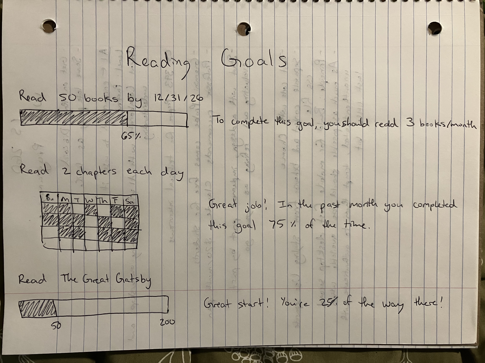

# Page Turners

[My Notes](notes.md)

A reading tracking app. Users can set goals for pages, chapters, or books read. When they achieve a goal, other users are notified. They also earn personalized rewards.

> [!NOTE]
> This is a template for your startup application. You must modify this `README.md` file for each phase of your development. You only need to fill in the section for each deliverable when that deliverable is submitted in Canvas. Without completing the section for a deliverable, the TA will not know what to look for when grading your submission. Feel free to add additional information to each deliverable description, but make sure you at least have the list of rubric items and a description of what you did for each item.

> [!NOTE]
> If you are not familiar with Markdown then you should review the [documentation](https://docs.github.com/en/get-started/writing-on-github/getting-started-with-writing-and-formatting-on-github/basic-writing-and-formatting-syntax) before continuing.

### Elevator pitch

Do you want to read more? Page Turners will help you! Set goals and track your reading progress. Use personalized rewards to motivate yourself.

### Design

### Key features

- Set goals in pages, chapters, or books read. Goals can have an optional end date.
- If a goal has an end date, the app will calculate how much you should read each day to achieve it.
- Users earn rewards (user entered real world rewards) for completing goals.
- When a user completes a goal, other users are notified.
- Users can enter how much they read each day.
- Goal progress will be shown based on the entered amounts read.

### Technologies

I am going to use the required technologies in the following ways.

- **HTML** - Uses correct HTML structure for application. 5 HTML pages: login, goals, reading tracker, notifications, rewards.
- **CSS** - Application styling that looks good on different screen sizes, uses good whitespace, color choice and contrast.
- **React** - Provides login, allows users to enter and view goals and rewards, backend endpoint calls. Application with component views and reactive to user's actions.
- **Service** - Backend service with endpoints for:
    - retrieving goals
    - retrieving rewards
    - creating goals
    - creating rewards
    - achieving a goal
    - earning a reward
    - entering reading
    - Register, login, and logout users. Credentials securely stored in database. Can't create goals, track reading, or earn rewards unless authenticated.
- **DB/Login** - Store authentication information, users, goals, rewards, and reading tracking in database.
- **WebSocket** - When a user completes a goal, a notification is sent to all other users.
- **3rd Party API** - Used to get book quotes that are displayed on the login page

## 🚀 Specification Deliverable

> [!NOTE]
> Fill in this sections as the submission artifact for this deliverable. You can refer to this [example](https://github.com/webprogramming260/startup-example/blob/main/README.md) for inspiration.

For this deliverable I did the following. I checked the box `[x]` and added a description for things I completed.

- [x] I completed the prerequisites for this deliverable (Git commit requirement)
- [x] Proper use of Markdown
- [x] A concise and compelling elevator pitch
- [x] Description of key features
- [x] Description of how you will use each technology including your 3rd party API and use of WebSocket
- [x] One or more rough sketches of your application. Images must be embedded in this file using Markdown image references.

## 🚀 AWS deliverable

For this deliverable I did the following. I checked the box `[x]` and added a description for things I completed.

- [ ] **Rented EC2 server** - I did not complete this part of the deliverable.
- [ ] **Leased domain name** - I did not complete this part of the deliverable.
- [ ] **Server accessible** from my domain: [https://yourdomainnamehere.click](https://yourdomainnamehere.click) - I did not complete this part of the deliverable.

## 🚀 HTML deliverable

For this deliverable I did the following. I checked the box `[x]` and added a description for things I completed.

- [ ] I completed the prerequisites for this deliverable (Simon deployed, GitHub link, Git commits)
- [ ] **HTML pages** - I did not complete this part of the deliverable.
- [ ] **Proper HTML element usage** - I did not complete this part of the deliverable.
- [ ] **Links** - I did not complete this part of the deliverable.
- [ ] **Text** - I did not complete this part of the deliverable.
- [ ] **3rd party API placeholder** - I did not complete this part of the deliverable.
- [ ] **Images** - I did not complete this part of the deliverable.
- [ ] **Login placeholder** - I did not complete this part of the deliverable.
- [ ] **DB data placeholder** - I did not complete this part of the deliverable.
- [ ] **WebSocket placeholder** - I did not complete this part of the deliverable.

## 🚀 CSS deliverable

For this deliverable I did the following. I checked the box `[x]` and added a description for things I completed.

- [ ] I completed the prerequisites for this deliverable (Simon deployed, GitHub link, Git commits)
- [ ] **Visually appealing colors and layout. No overflowing elements.** - I did not complete this part of the deliverable.
- [ ] **Use of a CSS framework** - I did not complete this part of the deliverable.
- [ ] **All visual elements styled using CSS** - I did not complete this part of the deliverable.
- [ ] **Responsive to window resizing using flexbox and/or grid display** - I did not complete this part of the deliverable.
- [ ] **Use of a imported font** - I did not complete this part of the deliverable.
- [ ] **Use of different types of selectors including element, class, ID, and pseudo selectors** - I did not complete this part of the deliverable.

## 🚀 React part 1: Routing deliverable

For this deliverable I did the following. I checked the box `[x]` and added a description for things I completed.

- [ ] I completed the prerequisites for this deliverable (Simon deployed, GitHub link, Git commits)
- [ ] **Bundled using Vite** - I did not complete this part of the deliverable.
- [ ] **Components** - I did not complete this part of the deliverable.
- [ ] **Router** - I did not complete this part of the deliverable.

## 🚀 React part 2: Reactivity deliverable

For this deliverable I did the following. I checked the box `[x]` and added a description for things I completed.

- [ ] I completed the prerequisites for this deliverable (Simon deployed, GitHub link, Git commits)
- [ ] **All functionality implemented or mocked out** - I did not complete this part of the deliverable.
- [ ] **Hooks** - I did not complete this part of the deliverable.

## 🚀 Service deliverable

For this deliverable I did the following. I checked the box `[x]` and added a description for things I completed.

- [ ] I completed the prerequisites for this deliverable (Simon deployed, GitHub link, Git commits)
- [ ] **Node.js/Express HTTP service** - I did not complete this part of the deliverable.
- [ ] **Static middleware for frontend** - I did not complete this part of the deliverable.
- [ ] **Calls to third party endpoints** - I did not complete this part of the deliverable.
- [ ] **Backend service endpoints** - I did not complete this part of the deliverable.
- [ ] **Frontend calls service endpoints** - I did not complete this part of the deliverable.
- [ ] **Supports registration, login, logout, and restricted endpoint** - I did not complete this part of the deliverable.
- [ ] **Uses BCrypt to hash passwords** - I did not complete this part of the deliverable.

## 🚀 DB deliverable

For this deliverable I did the following. I checked the box `[x]` and added a description for things I completed.

- [ ] I completed the prerequisites for this deliverable (Simon deployed, GitHub link, Git commits)
- [ ] **Stores data in MongoDB** - I did not complete this part of the deliverable.
- [ ] **Stores credentials in MongoDB** - I did not complete this part of the deliverable.

## 🚀 WebSocket deliverable

For this deliverable I did the following. I checked the box `[x]` and added a description for things I completed.

- [ ] I completed the prerequisites for this deliverable (Simon deployed, GitHub link, Git commits)
- [ ] **Backend listens for WebSocket connection** - I did not complete this part of the deliverable.
- [ ] **Frontend makes WebSocket connection** - I did not complete this part of the deliverable.
- [ ] **Data sent over WebSocket connection** - I did not complete this part of the deliverable.
- [ ] **WebSocket data displayed** - I did not complete this part of the deliverable.
- [ ] **Application is fully functional** - I did not complete this part of the deliverable.
